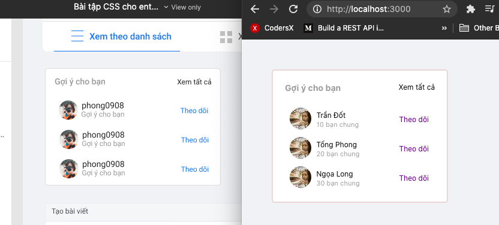

## BÀI 8
#### BÀI 1
Sử dụng kiến thức đã học để viết lại component:
 https://www.figma.com/file/M2Lh7XaEKWnds9SeEuJ1l0/B%C3%A0i-t%E1%BA%ADp-CSS-cho-entry-test?node-id=61%3A27
1) Tạo component: `<RecommendedFriends friends={...} />`
2) Tạo component con: `<FollowFriendListItem user={...} />`
3) Sử dụng `map` để render nhiều `component` con trong `component` cha dựa vào `prop` `friends`
___

Almost the same ^^

